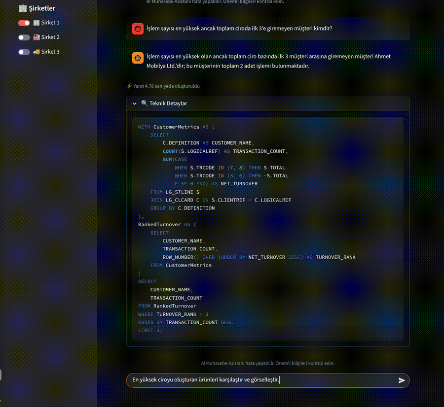

# LLM Destekli LOGO ERP Sorgulama ve Analitik Sistemi

LOGO ERP sistemlerindeki verilere, analizlere ve raporlama süreçlerine doğal dil aracılığıyla erişim sağlamak amacıyla geliştirilmiş yapay zekâ destekli bir asistandır.

---

## Demo

### Karmaşık Sorgu Üretimi

**Kullanıcı Sorgusu**

> İşlem sayısı en yüksek ancak toplam ciroda ilk 3'e giremeyen müşteri kimdir?

  

---

### Analitik ve Görselleştirme

**Kullanıcı Sorgusu**

> En yüksek ciroyu oluşturan ürünleri karşılaştır ve görselleştir.

  

---

## Genel Bakış

Bu proje, kullanıcıların LOGO ERP sistemleriyle doğal dil kullanarak etkileşim kurmasını sağlayan yapay zekâ destekli bir sorgulama ve analitik platformudur.

Kullanıcı sorgularını işleyerek LOGO ERP verileri üzerinde analizler gerçekleştirebilir, raporlar oluşturabilir ve sonuçları görselleştirebilir. Sistem, teknik bilgi gerektirmeden veri erişimini ve karar destek süreçlerini kolaylaştırmayı hedeflemektedir.

## Temel Özellikler

* Doğal Dilden SQL'e Dönüşüm (Natural Language to SQL)
* Niyet ve Alt-Niyet Tabanlı Akıllı Sorgu Yönlendirme
* Retrieval-Augmented Generation (RAG)
* Hybrid Retrieval (BM25 + Vector Embeddings)
* Çok Ajanlı (Multi-Agent) LLM Mimarisi
* Dinamik Şema ve Prompt Üretimi
* Dinamik Raporlama ve Analitik
* Otomatik Grafik ve Görselleştirme Üretimi
* Bağlama Duyarlı ERP Veri Erişimi

## Kullanılan Teknolojiler

* Python
* Gemini 2.5 Flash-Lite
* Retrieval-Augmented Generation (RAG)
* BM25
* Vektör Gömme (Vector Embeddings)
* Natural Language to SQL (NL2SQL)
* SQL Server
* Multi-Agent Sistemler
* Veri Görselleştirme

## Sonuçlar

* 500'den fazla ERP odaklı sorgu üzerinde değerlendirilmiştir.
* Test senaryolarında %95'in üzerinde tatmin edici yanıt başarısı elde edilmiştir.
* Ortalama yanıt süresi 3–5 saniye arasındadır.
* Karmaşık iş analitiği senaryolarını destekleyerek SQL üretimi, veri analizi ve otomatik görselleştirme yetenekleri sunmaktadır.

## Not

Bu depo, proje hakkında yüksek seviyeli bir genel bakış sunmaktadır. Projenin tam uygulaması, kaynak kodu, iş kuralları, veri modelleri ve kuruma özgü bileşenleri Harezmî bünyesinde geliştirilmiş olup gizlilik yükümlülükleri ve fikri mülkiyet hakları nedeniyle paylaşılmamaktadır.
